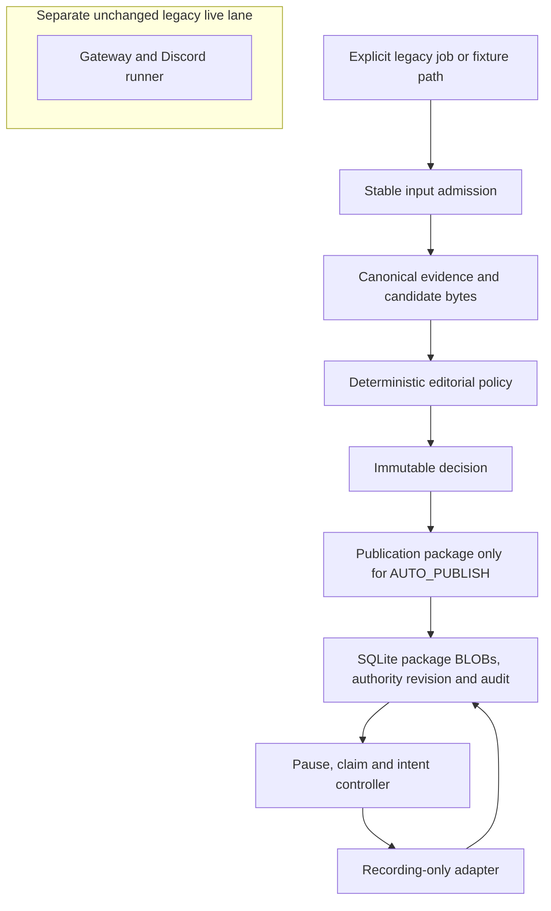
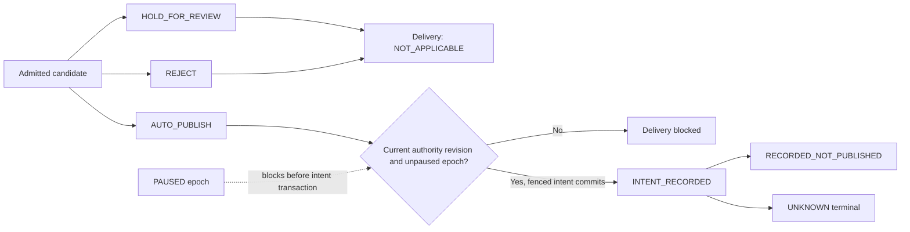

# Editorial Governance Shadow Lane - Plan

## Goal Capsule

- **Objective:** Add the first executable governance slice for the future autonomous editorial system: immutable package identities, explicit editorial outcomes, a durable decision and audit store, and a credential-free shadow publication controller.
- **Authority:** The owner's 12 July 2026 instruction to repurpose the repository authorises implementation of the selected Draft requirements below. The specification text remains authoritative when this plan and the specifications differ.
- **Execution profile:** Deliver one safe vertical slice in the existing Python 3.12 package, protect behaviour with focused tests first, and keep the live Discord runner unchanged.
- **Stop conditions:** Stop rather than infer a product exception if implementation would enable a public side effect, weaken a hold or reject gate, alter a specification, retain unknown-rights source expression, or require a live publishing credential.
- **Tail ownership:** The LFG caller owns simplification, code review, commit, pull request, and CI after implementation returns.

---

## Product Contract

### Summary

Build a separate shadow governance lane that can evaluate prepared newsroom artefacts against versioned package and policy contracts without importing or invoking the live Gateway publisher. It will expose where current jobs lack evidence, rights, risk, and policy data while proving deterministic decision, audit, pause, and idempotency foundations for later migration.

### Problem Frame

The current pipeline treats a structurally valid worker result as `SUCCESS` and can proceed directly to Discord. Its mutable job files, source packs, diagnostic JSONL logs, dedupe markers, and message IDs are useful operational state, but they are not the immutable evidence, semantic decision, publication package, or mandatory audit boundary required by the future product specifications.

The complete specification suite is too broad for one safe implementation change. Claiming conformance before source rights, sensitive-risk, content-faithfulness, reviewer authority, credential separation, and provider reconciliation exist would make the system less trustworthy. This plan therefore establishes an isolated shadow lane that records truthful gaps and has no public capability.

### Actors

- A1. **Legacy pipeline:** Produces mutable `story_job_v1` files, source packs, and worker results that the shadow lane treats as untrusted compatibility input.
- A2. **Shadow evaluator:** Freezes admitted input into versioned package bytes, applies deterministic policy, and records exactly one editorial outcome.
- A3. **Deterministic controller:** Owns delivery lifecycle transitions, pause mediation, intent creation, and the credential-free recording adapter.
- A4. **Operator:** Uses local commands to evaluate an input, inspect an exact version, pause or resume the shadow scope, and verify audit integrity.
- A5. **Future reviewer or live publisher:** Deliberately absent from this slice.

### Requirements

**Immutable contracts and version identity**

- R1. The shadow lane must produce evidence and pre-decision candidate manifests as immutable, content-addressed bytes with schema, encoding, digest algorithm, byte size, provenance, and component-version identity; the governance store owns durable installation of those exact bytes. Provides shadow implementation evidence for `EVID-070`, `EVID-074`, `QA-001`, and `QA-002`.
- R2. Every pre-decision candidate manifest must reference its evidence digest and identify the candidate, story version, content and asset digests, gate results, policy version, controller version, validator results, and shadow target without embedding a decision or outcome. Provides the input foundation for `AUTO-022`, `AUTO-023`, `CONT-070`, and `AUDIT-002`.
- R3. The immutable decision digest must bind the candidate digest, evidence digest, policy version, and controller version without circular identity. Only `AUTO_PUBLISH` may create a publication package that references that decision. A separate monotonic authority revision must move the current head for a stable story, story version, and target; a byte, target, policy, controller, referenced-package, or rollback change creates a fresh authority revision even when it reuses a historical decision digest. Provides shadow implementation evidence for `AUTO-012`, `AUTO-014`, `AUTO-022`, `AUTO-023`, `QA-005`, and `QA-054`.

**Decision and capability boundary**

- R4. Every admitted package must receive exactly one current editorial outcome from `AUTO_PUBLISH`, `HOLD_FOR_REVIEW`, or `REJECT`, with stable reason codes in deterministic order. Covers `AUTO-010` and `AUTO-011`.
- R5. A closed, versioned shadow-policy contract must own the mandatory gate names, outcome mapping, canonical reason order, component versions, target allowlist, trusted-root identifiers, resource limits, and specification trace. Outcome precedence must be `REJECT` over `HOLD_FOR_REVIEW` over `AUTO_PUBLISH`; only explicit passes may be eligible, while missing, unknown, expired, conflicting, or indeterminate inputs must hold and known prohibitions must reject. Covers `AUTO-002`, `AUTO-012`, `AUTO-013`, `AUTO-040`, `AUTO-042`, `AUTO-043`, `RIGHTS-004`, `RISK-001`, and `RISK-003` at the trace boundaries below.
- R6. Editorial outcome and delivery lifecycle must remain separate: `AUTO_PUBLISH` means shadow eligibility, while a recording receipt must state `RECORDED_NOT_PUBLISHED` and never claim a public action. Provides non-publishing dry-run evidence toward `AUTO-010`, `AUTO-012`, and `QA-050`; `QA-051` comparison remains deferred.
- R7. The shadow entrypoint must have no transitive dependency, credential/configuration injection, publisher registry, or network call path to Gateway, Discord, or another public target, and it must reject `agent_posts` and unknown targets. This is foundation evidence toward `AUTO-020`, `AUTO-021`, `AUTO-025`, `AUTO-030`, `AUTO-031`, `AUTO-032`, and `AUTO-035`, not whole-system capability separation.

**Durable state, audit, and control**

- R8. A separate local SQLite governance store must persist exact package bytes as bounded BLOBs, decisions, monotonic authority revisions and heads, pause epochs, delivery intents, receipts, and internally verifiable append-only audit events with the lineage available from admitted input. Provides shadow implementation evidence for `AUDIT-002` through `AUDIT-005`; complete `AUDIT-001` lineage remains deferred.
- R9. Audit and a unique delivery intent must commit in one transaction before adapter invocation; an audit failure must prevent the transition. Covers `AUDIT-005`, `AUDIT-010`, and `AUDIT-012`.
- R10. Delivery identity must be unique by publication digest, decision identity, target, and action version; replay must reuse the existing intent, and an ambiguous dispatch result must become terminal `UNKNOWN` without a retry or success conversion in this slice. Provides recording-adapter evidence for `AUTO-024`, `AUDIT-010`, and `AUDIT-012`.
- R11. Concurrent workers must use short transactional claims, conditional transitions, and monotonically increasing fencing tokens so an expired owner cannot resume or invoke the adapter with stale authority.
- R12. A new store must bootstrap `PAUSED` at epoch 1 with a genesis audit event and require explicit resume before eligibility can enter delivery. The fenced intent transaction is the shadow lane's linearisation point: a pause committed first blocks intent creation, while a pause committed after that transaction does not retroactively cancel the already-entered recording operation. Missing, malformed, unreadable, or unsupported pause state must fail closed. This provides foundation evidence toward `AUTO-040`, `AUTO-041`, `AUTO-060`, and `AUTO-062`, but it is not the suite-wide global pause or an out-of-process kill switch.
- R13. Pause and resume must record the same-OS-account caller identity, reason, timestamp, and epoch, and resume must not automatically dispatch earlier eligible decisions. This slice does not satisfy `AUTO-063` authenticated-resume separation and must state that gap.

**Compatibility and operator evidence**

- R14. Legacy jobs must pass two parsing stages: a bounded duplicate-key-aware compatibility decoder projects an explicit allowlist from the open legacy shape, then strict closed package validation admits only the projected form. Source jobs must be read once as untrusted input and never receive authoritative shadow fields in place; malformed JSON or an unconstructable candidate occurrence must produce an intake error rather than a fourth editorial outcome.
- R15. Current legacy jobs with absent structured rights, sensitive-risk, claim-evidence, or versioned policy records must deterministically become `HOLD_FOR_REVIEW` under a stable migration-uncertainty reason; evidence that is substantively insufficient under the specifications must still `REJECT`. Unknown-rights publisher text must not be copied into permanent governance storage. Provides compatibility evidence for `RIGHTS-004`, `RIGHTS-012`, and `RIGHTS-016` without overriding `EVID-036`.
- R16. A local CLI must expose an early pure `evaluate` command after package and decision work, then explicit `record`, exact-version `inspect`, `pause`, `resume`, and `audit-verify` commands after the store and controller exist, without background discovery or implicit selection of the latest version. Inspection output must be metadata-only and limited to identifiers, digests, outcomes, reason codes, component versions, integrity status, and audit evidence; every persisted-state inspection must itself be audited.
- R17. The repository documentation and package metadata must describe the future editorial direction, the shadow/live boundary, selected requirement coverage, known non-conformance, and the removal gates for the legacy publisher.
- R18. The first slice is POSIX-local-filesystem only. The CLI must accept a policy-defined trusted-root identifier plus a relative path, never an arbitrary root from CLI or environment; admit only bounded regular files; reject traversal, links, identity swaps, unsafe state roots, and unavailable required POSIX capabilities; and use private owner-only storage for the database, WAL, SHM, and temporary files. Windows, network filesystems, and filesystems lacking the required descriptor and durability semantics are unsupported and fail closed.
- R19. Candidate occurrence identity (`run_id + story_id`) must remain provenance only. Authority heads must be keyed by explicit stable story identity, story version, and target; legacy input lacking a non-URL stable story key receives a compatibility identity and a mandatory `HOLD_FOR_REVIEW` reason. Intent creation must verify the current authority revision and bind its identifier, the observed pause epoch, claimant, lease, and fencing token in the same transaction.
- R20. Every committed package row must contain the exact canonical bytes and matching digest in the same SQLite transaction as its authoritative reference. The closed shadow policy must define non-zero maximum input and package bytes, total database bytes, minimum free-space reserve, and bounded WAL/checkpoint thresholds; absent or exceeded limits fail before durable admission. Digest mismatch or missing bytes is store corruption and blocks later transitions.
- R21. Governance schema bootstrap and migration must be atomic with version metadata written last, required PRAGMA values verified on every connection, newer or partial schemas rejected, and the audit genesis/head/count verified on open. This first slice supports only its declared schema version; migration to a later version and backup/restore tooling are deferred until a real transition exists.

### Key Flows

- F1. **Evaluate a compatibility input**
  - **Trigger:** A4 supplies an explicit legacy job or fixture path.
  - **Actors:** A1, A2, A4.
  - **Steps:** The evaluator takes a stable snapshot, projects the compatibility allowlist, validates and canonicalises package bytes, and produces a deterministic decision without writing governance state.
  - **Outcome:** The CLI returns exact package and decision identifiers plus the editorial outcome; delivery is `NOT_REQUESTED`.
  - **Covered by:** R1-R7, R14-R19.
- F2. **Record an eligible shadow package**
  - **Trigger:** A4 explicitly requests recording of an admitted exact package and decision.
  - **Actors:** A2, A3, A4.
  - **Steps:** The evaluator first constructs the eligible publication package; the store then transactionally installs every referenced package BLOB, decision, monotonic authority revision, and audit. The controller records an intent and receipt only when explicitly resumed and unpaused at the fenced intent transaction.
  - **Outcome:** The CLI returns separate editorial and recording delivery states, with no public action capability.
  - **Covered by:** R3, R6-R13, R16, R19-R21.
- F3. **Pause and resume shadow delivery**
  - **Trigger:** A4 supplies an actor and reason to pause or resume.
  - **Actors:** A3, A4.
  - **Steps:** The store advances the pause epoch and audit chain; eligible decisions remain immutable, and resumed work requires fresh evaluation.
  - **Outcome:** No queued work is passively approved or dispatched.
  - **Covered by:** R9-R13, R16.
- F4. **Verify or reconstruct a decision**
  - **Trigger:** A4 supplies an exact package, decision, or intent identifier.
  - **Actors:** A2, A3, A4.
  - **Steps:** The tool verifies package digests, audit ordering and hashes, lineage, policy and component versions, intent, and receipt.
  - **Outcome:** Valid history is reconstructed; tampering, deletion, reordering, or broken links fail verification and close future transitions.
  - **Covered by:** R1-R3, R8-R10, R16.

### Acceptance Examples

- AE1. **Complete shadow fixture:** Given a rights-cleared fixture with an explicit stable story identity and all required gate results, pure evaluation yields `AUTO_PUBLISH`, one publication package, and delivery `NOT_REQUESTED`. When an operator explicitly records that exact package against an explicitly resumed fresh store, exactly one intent and one `RECORDED_NOT_PUBLISHED` receipt exist, and no external call is possible.
- AE2. **Current legacy gap:** Given a current `story_job_v1` with worker success but no rights, risk, and claim-evidence records, when it is evaluated, then it is `HOLD_FOR_REVIEW` with stable missing-input reasons and no intent.
- AE3. **Reject beats missing data:** Given a known prohibited fact and other missing fields, when evaluated, then the result is `REJECT`, no publication package exists, and no intent exists.
- AE4. **Package integrity:** Given semantically identical supported JSON with reordered object keys, each pre-decision package digest remains stable; changing content, assets, target, policy, controller, or evidence creates a new decision digest and, when eligible, a new publication package without circular identity.
- AE5. **Pause ordering:** Given an eligible decision, when pause commits before the fenced intent transaction, then no recording operation is entered; when pause commits after that transaction, the already-entered recording may finish and the audit order proves the boundary. A fresh, missing, corrupt, or unsupported pause state cannot create an intent.
- AE6. **Concurrent claim:** Given two evaluators claiming the same decision, then one canonical intent and receipt exist and a stale fencing token cannot advance state.
- AE7. **Crash and ambiguity:** Given a crash after package, decision, intent, or adapter return, replay reconstructs the state without a duplicate intent; an unconfirmed dispatch stays terminal `UNKNOWN` in this slice.
- AE8. **Audit integrity:** Given a modified, deleted, reordered, or relinked audit event or modified package bytes, audit verification fails non-zero and later intent transitions fail closed.
- AE9. **Capability absence:** Given any Gateway environment variables or monkeypatched network and message functions, evaluation produces the same shadow result and imports no live publishing module.
- AE10. **Stable story identity:** Given two run occurrences for the same explicit stable story identity, they preserve distinct occurrence provenance but converge on one authority-head namespace; repeated `story_01` occurrences with different stable story identities do not collide, and a URL-only legacy key forces a compatibility hold.
- AE11. **Authority supersession:** Given a current eligible decision and a later package or policy version, only the fresh monotonic authority revision may create an intent; the historical decision digest remains inspectable, and rolling back to its content creates another revision rather than reviving its old authority.
- AE12. **Unsafe path rejection:** Given traversal, symlink, hard-link, parent-swap, inode-replacement, oversized, non-regular, misowned, or permissive-root input, admission fails with no package reference, decision, intent, or adapter call.
- AE13. **Transactional package durability:** Given a crash before or after a package transaction commits, reopening exposes either no package row or one row whose canonical BLOB, digest, decision reference, and audit record agree; it never exposes an accepted missing or mismatched package.

### Success Criteria

- All selected requirements have an explicit trace status and plan-scoped acceptance evidence; foundation-only and deferred requirements are not claimed as implemented.
- The complete fixture, legacy hold, prohibition, pause, concurrency, crash, tamper, and forbidden-capability scenarios pass deterministically.
- The existing Discord runner tests and full repository suite remain green with no live behaviour change.
- Documentation states that this slice is not production conformance and cannot publish publicly.

### Scope Boundaries

#### Included in this plan

- Package identity and integrity foundations from `docs/specs/editorial-automation/story-eligibility-and-evidence.md`.
- Shadow-only decision, controller, fail-closed, and emergency-pause foundations from `docs/specs/editorial-automation/autonomy-and-publication-control.md`.
- Minimum unknown-rights retention behaviour from `docs/specs/editorial-automation/rights-and-visuals.md`.
- Article package identity only from `docs/specs/editorial-automation/content-generation-and-presentation.md`.
- Decision lineage and audit foundations from `docs/specs/editorial-automation/publication-lifecycle-and-audit.md`.
- Version capture and shadow comparison foundations from `docs/specs/editorial-automation/quality-evaluation-and-change-control.md`.

#### Deferred to Follow-Up Work

- Full source classification, claim extraction, corroboration, freshness, and evidence-sufficiency enforcement.
- Rights-register administration, source adapters, permitted model destinations, retention schedules, and asset/visual controls.
- Sensitive-content classifiers, jurisdiction-specific legal checks, reviewer roles, authenticated approval, and redaction workflows.
- Content-faithfulness, originality, Cantonese-language, terminology, quotation, headline, and numerical validators.
- Live controller migration, dedicated publish credentials, Discord/provider reconciliation, corrections, withdrawal, archives, notifications, and public application surfaces.
- Production-versus-candidate shadow comparison under `QA-051`, production evaluation thresholds, canary release, external audit anchoring, WORM retention, credential revocation, and out-of-process kill switches.
- Authenticated operator identity and agent-resistant pause/resume authority under `AUTO-063`; the local same-account CLI is a temporary non-production trust model.
- Capture of durable `docs/solutions/` learnings after implementation; no learning corpus exists yet.

#### Outside this product's identity

- Investigative reporting, private-document collection, anonymous-source publication, public comments, popularity ranking, and a general-purpose emergency-alert service remain outside the specification suite.

### Temporary Compatibility

The existing Discord runner, `agent_posts` schema compatibility, mutable jobs, Gateway credential shape, and live publishing behaviour remain unchanged and explicitly non-conformant. The shadow lane must not import them as runtime dependencies. Their removal or migration requires accepted policy, complete substantive gates, credential separation, provider reconciliation, release evaluation, and owner approval.

---

## Planning Contract

### Product Contract Preservation

The selected specification requirements are unchanged. This plan narrows delivery to a shadow foundation and does not restate Draft requirements as whole-system conformance.

### Requirement Trace Status

| Specification requirements | Status in this plan | Evidence boundary |
|---|---|---|
| `AUTO-010`-`AUTO-014` | Implemented in shadow | Deterministic outcomes, reasons, publication-package gating, no passive approval, and versioned re-entry. |
| `AUTO-022`, `AUTO-023`, `AUTO-024`, `AUTO-025` | Implemented for recording target | Final package, integrity invalidation, local intent idempotency, and fixed allowlist. |
| `EVID-070`, `EVID-074` | Implemented in shadow | Writer-independent immutable package identity and digest verification. |
| `AUDIT-002`-`AUDIT-005`, `AUDIT-010`, `AUDIT-012` | Implemented for admitted shadow lineage | Decision fields, append-only verification, reconstruction, audit-before-intent, receipt, and local partial-failure state. |
| `QA-001`, `QA-002`, `QA-005`, `QA-050` | Implemented for slice components | Version capture, policy trace, and non-publishing execution. |
| `AUTO-020`, `AUTO-021`, `AUTO-030`-`AUTO-032`, `AUTO-035` | Foundation only | Shadow entrypoint has no live dependency edge, but the same installed distribution still contains the non-conformant live runner. |
| `AUTO-002` | Foundation only | A closed versioned shadow policy is implemented, but it is not an accepted production policy. |
| `AUTO-040`-`AUTO-043`, `AUTO-060`, `AUTO-062` | Foundation only | Unknown or failed inputs and the shadow pause fail closed, but the control does not cover every live target. |
| `AUDIT-001`, `QA-054` | Foundation only | Available legacy lineage and current-authority heads are retained; complete lead-to-public lineage and live queued-work migration are deferred. |
| `CONT-070`, `LIFE-001`, `EVID-036` | Foundation only | Stable story identity, required article fields, and known insufficiency are represented for synthetic fixtures; the legacy lane lacks complete structured inputs. |
| `RISK-001`, `RISK-003` | Compatibility foundation | Missing risk classification or jurisdiction deterministically holds; substantive classifiers and legal checks are deferred. |
| `RIGHTS-004`, `RIGHTS-012`, `RIGHTS-016` | Compatibility foundation | Unknown rights hold and minimise retained expression; a rights register is deferred. |
| `AUTO-063`, `QA-051` | Deferred and non-conformant | The CLI lacks authenticated operator separation and does not compare against production decisions. |

### Assumptions

- The owner's instruction is explicit authority to implement the selected Draft requirements, but it does not change their document status to `Accepted`.
- The first safe repurpose slice is a new shadow entrypoint rather than an in-place migration of the live runner; true physical capability separation requires a later separately built and deployed runtime identity.
- `AUTO_PUBLISH` is an immutable editorial eligibility outcome; shadow delivery has a separate recording lifecycle and cannot create a public item.
- One private, owner-only SQLite database on a POSIX local filesystem is the authoritative governance store for package BLOBs and relational state; NAS, arbitrary writable roots, and multi-database atomicity are unsupported.
- Unknown-rights legacy inputs retain digests, provenance, and minimal permitted metadata rather than extracted publisher text.
- No human approval action exists in this slice; held candidates remain held. Every process running as the same OS account is explicitly trusted for this shadow tool, so the local pause/resume caller is not authenticated against agents or peer processes. A separate OS/service identity is a prerequisite for any live controller.
- The recording adapter is the only target and returns `RECORDED_NOT_PUBLISHED`; a live adapter cannot be selected through configuration.
- Internally verifiable hash chaining detects the tested application-level mutations but does not provide administrator-proof immutability or non-repudiation.
- All timestamps are explicit UTC text values parsed by application code; deprecated default SQLite datetime converters are not used.
- `UNKNOWN` is terminal in this slice. No reconciliation command may convert it to recorded or retry the adapter.

### Key Technical Decisions

| ID | Decision | Rationale |
|---|---|---|
| KTD1 | Use a pure `newsroom.editorial` dependency direction and a shadow entrypoint that never imports or configures Gateway, runner, network, or live publisher modules. | This proves no trusted dependency edge in the slice; true capability separation is deferred to a separately built runtime, credentials, and egress policy. |
| KTD2 | Use the maintained Python `rfc8785` package behind a versioned restricted-domain wrapper: integers are limited to the inclusive I-JSON safe range `-9007199254740991` to `9007199254740991`, output is UTF-8, and floats, lone surrogates, duplicate names, and unsupported types are rejected before encoding. Authority remains disabled until the wrapper matches RFC vectors plus Traditional Chinese and non-BMP cross-implementation vectors. | A reviewed dependency avoids making a custom standards-sensitive encoder the permanent identity boundary; the wrapper narrows the library's wider input domain to the product contract. |
| KTD3 | Validate all contracts with explicitly instantiated Draft 2020-12 validators, local schema registries, and application checks for critical formats. | Schema draft, reference resolution, and format checking must not drift with library defaults. |
| KTD4 | Keep editorial outcome immutable and model recording delivery as a separate lifecycle. | `AUTO_PUBLISH` must not be confused with a public side effect or legacy worker `SUCCESS`. |
| KTD5 | Use a separate SQLite governance store with explicit transaction control, WAL, foreign keys, `synchronous=FULL`, atomic versioned migrations, short `BEGIN IMMEDIATE` claims, conditional transitions, and fencing tokens. | Governance writes require local durability and concurrency semantics distinct from the prunable news pool, and must not inherit its non-atomic migration pattern. |
| KTD6 | Commit audit plus unique intent before adapter invocation, then record the receipt in a later transaction. | A public-capable successor must never perform an unaudited side effect, and ambiguous outcomes need a durable intent. |
| KTD7 | Persist bounded canonical package bytes as SQLite BLOBs in the same transaction as their references, decisions, and audit records. | The first slice has no measured size or streaming need that justifies an external blob tree; one authority removes dual-store reconciliation and paired-restore complexity. External object storage requires a later quantitative threshold and migration plan. |
| KTD8 | Treat malformed or unstable legacy input as an intake error, not `REJECT`; apply `REJECT > HOLD_FOR_REVIEW > AUTO_PUBLISH` only after package admission. | The three semantic outcomes apply to candidates, not corrupted transport input. |
| KTD9 | Bootstrap paused, require explicit actor and reason for resume, and make the fenced intent transaction the ordering boundary between pause and recording. | Absence, timeout, or recovery must never become passive approval, while a local recording operation cannot honestly be cancelled after its intent transaction has committed. |
| KTD10 | Call the hash-chained log internally verifiable append-only audit, not immutable audit. | A local administrator can rewrite both records and hashes; stronger claims require an external anchor. |
| KTD11 | Separate the pre-decision candidate digest, immutable decision identity, and final publication digest. | Embedding outcome and reasons in the input being decided would create a self-referential identity cycle. |
| KTD12 | Maintain one current monotonic authority revision per stable story identity, story version, and target, independently of deterministic decision digests and run-scoped candidate occurrences. | Exact identifiers support inspection and digest reuse, but an old authority identifier can never be revived after supersession or rollback. |
| KTD13 | Bind each intent to the current authority revision, observed pause epoch, claimant, lease, and fencing token. | A stale process must be denied before adapter entry, not merely when persisting its receipt. |
| KTD14 | Resolve named input and state roots only from the checked-in closed policy, admit files through descriptor-pinned bounded regular-file reads, require declared POSIX capabilities, and store governance data under a private owner-only local root. | Path traversal, symlink swaps, permissive WAL/SHM files, and accidental use of incompatible filesystems are credible local threat paths; CLI and environment overrides would reopen the authority boundary. |
| KTD15 | Leave `UNKNOWN` terminal and unactionable in this slice. | Evidence-backed provider reconciliation and authenticated operator authority do not exist yet, so any state-changing reconciliation would invent an unsafe path. |
| KTD16 | Version the closed shadow policy with the mandatory gate set, reason precedence, component versions, fixed recording target, trusted-root identifiers, an initial 16 MiB per-input/package cap, 512 MiB database cap, 256 MiB free-space reserve, and bounded WAL checkpoint settings. | Non-zero committed limits prevent configuration absence, disk exhaustion, or an unbounded append-only store from silently weakening governance. These are operational guardrails, not editorial thresholds. |

### High-Level Technical Design

#### Component topology



#### Audit-before-recording sequence

```mermaid
sequenceDiagram
  participant O as Operator
  participant E as Shadow evaluator
  participant S as Governance store
  participant C as Controller
  participant R as Recording adapter
  O->>E: Evaluate exact input path
  E->>E: Canonicalise and verify evidence and candidate bytes
  E->>E: Construct AUTO_PUBLISH package when eligible
  E->>S: Atomically commit all package BLOBs, decision, authority revision and audit
  S-->>E: Current decision and authority identifiers
  E->>C: Request shadow recording of current authority
  C->>S: Fenced transaction: check authority and pause; append audit plus unique intent
  S-->>C: Intent and fencing token
  C->>S: Read and re-verify exact package BLOB
  C->>R: Record exact package bytes
  R-->>C: Recording or unknown receipt
  C->>S: Append receipt and delivery transition
  C-->>O: Separate editorial and delivery states
```

#### Independent state machines



Pause is an orthogonal controller epoch, not an editorial or delivery outcome. An intent records the unpaused epoch and fence it observed; `UNKNOWN` has no outgoing transition in this slice.

### Output Structure

```text
newsroom/editorial/
  __init__.py
  packages.py
  policy.py
  decisions.py
  governance_store.py
  publication_control.py
  publishers.py
  legacy_adapter.py
newsroom/schemas/
  evidence_package_v1.schema.json
  editorial_candidate_v1.schema.json
  publication_package_v1.schema.json
  editorial_decision_v1.schema.json
  editorial_policy_v1.schema.json
newsroom/policies/
  editorial_shadow_v1.json
scripts/
  newsroom_editorial_shadow.py
newsroom/tests/
  test_editorial_packages.py
  test_editorial_policy.py
  test_editorial_decisions.py
  test_governance_store.py
  test_publication_control.py
  test_editorial_shadow_cli.py
  test_editorial_shadow_docs.py
  test_write_run_job.py
newsroom/evals/
  editorial_shadow/
scripts/_cli.py
pyproject.toml
uv.lock
README.md
ARCHITECTURE.md
newsroom/README.md
docs/plans/2026-07-12-001-feat-editorial-shadow-governance-plan.md
```

The tree declares the expected ownership boundaries. Implementation may split a module when that produces a clearer single responsibility without changing the capability boundary.

### System-Wide Impact

- **Security:** The shadow entrypoint has no trusted dependency or configuration path to publication or network clients; source and legacy job material remain untrusted data. The installed distribution still contains the separate live runner.
- **Data lifecycle:** Governance package BLOBs and audit rows are retained in one bounded SQLite authority, separately from prunable discovery data. Unknown-rights source expression is excluded.
- **Concurrency:** SQLite is single-writer. Short claims, bounded busy handling, CAS transitions, and fencing prevent stale owners from advancing work.
- **Operations:** The pause is local to the new shadow scope. It does not stop the legacy live runner and must be labelled accordingly.
- **Compatibility:** No current cron schedule, job producer, prompt, worker session, Discord message path, or news-pool migration changes in this slice.
- **Agent parity:** The deterministic composition root offers agents no approval, policy-mutation, or live-publisher API. This is a software boundary only: every same-OS-account process can still modify local files or invoke pause/resume and is therefore trusted in this shadow slice. Separate runtime identity and credentials are mandatory before live use.

### Risks and Mitigations

| Risk | Mitigation |
|---|---|
| Shadow foundations are mistaken for suite conformance. | Report selected IDs, deferred requirements, and the unchanged non-conformant live lane in CLI output and documentation. |
| Package hashing varies across platforms or inputs. | Version the restricted byte profile, reject floats, duplicate keys, unsupported Unicode or types as defined by the profile, and run conformance vectors. |
| Bounded package bytes or append-only audit growth exhaust local storage. | Enforce policy-owned per-input, per-package, database-size, free-space, WAL, and checkpoint limits before admission; fail closed if values are absent. |
| WAL contention or stale readers block progress. | Keep transactions and readers short, distinguish busy from CAS loss, use bounded retry only before side effects, and test checkpoint recovery. |
| Hash chaining is overclaimed. | Use the internally verifiable label and document external anchoring as a production prerequisite. |
| A compatibility adapter retains protected source text. | Persist minimal metadata and digests for unknown-rights input and hold the candidate. |
| A future live adapter is accidentally introduced through configuration. | Keep only the recording adapter in the shadow composition root, add dependency/import and network-denial tests, and require a separately built runtime for any future live adapter. |
| Pause races an operation already entering the recording adapter. | Use the fenced intent transaction as the explicit linearisation point, audit both orders, and avoid claiming that a later local pause retroactively cancels entered work. |
| A superseded decision remains callable by exact identifier. | Maintain and transactionally verify a monotonic authority revision independently of decision digest; rollback always creates a fresh revision. |
| Local path or permission attacks alter admitted input or governance state. | Resolve roots from closed policy, pin descriptor identity, reject unsafe links and modes, require POSIX capabilities, and protect DB, WAL, SHM, and temporary files. |
| Same logical story is fragmented across run-scoped occurrences. | Require explicit stable story identity for the auto path, preserve run/story only as provenance, and force URL-only compatibility identities to hold. |
| Schema migration partially applies or a connection weakens PRAGMAs. | Migrate atomically with version-last metadata, verify PRAGMA readback on every connection, and refuse newer or partial schemas. |
| Same-account actor text is mistaken for authentication. | Label pause/resume as local shadow control, record the caller identity separately from reason text, and defer `AUTO-063` conformance. |
| Exact inspection leaks retained source expression, personal data, or risk notes. | Return metadata-only fields, never raw package bytes or source/body content, and audit every persisted-state inspection. |

### Sources and Research

- Existing patterns: `newsroom/job_store.py`, `newsroom/news_pool_db.py`, `newsroom/runner.py`, `newsroom/source_pack.py`, `newsroom/schemas/story_job_v1.schema.json`, and the runner/job-store tests.
- [Python 3.12 sqlite3 transaction control](https://docs.python.org/3.12/library/sqlite3.html#transaction-control) informs explicit autocommit and transaction ownership.
- [SQLite isolation](https://www.sqlite.org/isolation.html), [transaction modes](https://www.sqlite.org/lang_transaction.html), [WAL](https://www.sqlite.org/wal.html), and [synchronous](https://www.sqlite.org/pragma.html#pragma_synchronous) inform local single-writer durability and busy handling.
- [Python JSON compliance](https://docs.python.org/3.12/library/json.html#standard-compliance-and-interoperability) and [RFC 8785](https://www.rfc-editor.org/rfc/rfc8785.html) inform the restricted canonical byte profile.
- [jsonschema 4.26 validation](https://python-jsonschema.readthedocs.io/en/v4.26.0/validate/) and [referencing migration](https://python-jsonschema.readthedocs.io/en/v4.26.0/referencing/) inform explicit validators, formats, and local registries.
- [OWASP LLM Excessive Agency](https://genai.owasp.org/llmrisk/llm062025-excessive-agency/), [OWASP Prompt Injection Prevention](https://cheatsheetseries.owasp.org/cheatsheets/LLM_Prompt_Injection_Prevention_Cheat_Sheet.html), and [OWASP fail-secure guidance](https://owasp.org/www-community/Fail_securely) inform the capability and failure boundaries.
- [AWS transactional outbox guidance](https://docs.aws.amazon.com/prescriptive-guidance/latest/cloud-design-patterns/transactional-outbox.html) and [idempotent API guidance](https://aws.amazon.com/builders-library/making-retries-safe-with-idempotent-APIs/) inform intent, receipt, and unknown-outcome handling.

---

## Implementation Units

### U1. Immutable editorial package contracts

- **Goal:** Define deterministic evidence, candidate, decision-input, and publication package identities without relying on mutable job state or a storage backend.
- **Requirements:** R1-R3; F1, F4; AE4 and the package-integrity part of AE8.
- **Dependencies:** None.
- **Files:** `newsroom/editorial/__init__.py`, `newsroom/editorial/packages.py`, `newsroom/schemas/evidence_package_v1.schema.json`, `newsroom/schemas/editorial_candidate_v1.schema.json`, `newsroom/schemas/publication_package_v1.schema.json`, `newsroom/tests/test_editorial_packages.py`, `pyproject.toml`, `uv.lock`.
- **Approach:** Wrap a maintained RFC 8785 implementation with the restricted admitted domain and explicit Draft 2020-12 validators, local registry, critical format checks, and digest verification. Reject duplicate keys during parsing and reject non-finite or floating values, unsafe integers, unsupported types, unresolved schema references, and invalid formats before canonicalisation. Keep candidate, decision, and `AUTO_PUBLISH`-only publication identities separate; no digest becomes authoritative until cross-implementation vectors pass.
- **Execution note:** Start with failing RFC, Hong Kong Traditional Chinese, non-BMP, tamper, and unstable-input conformance tests before exposing package construction.
- **Patterns to follow:** `newsroom/schemas/story_job_v1.schema.json` for explicit schema versioning, strengthened with closed contracts and explicit validator construction.
- **Test scenarios:**
  - Covers AE4. Reordered supported object keys and Hong Kong Traditional Chinese text produce stable exact bytes and digest; a content, target, asset, policy, or evidence change produces a new digest.
  - Duplicate names, floats, NaN, Infinity, unknown properties, malformed timestamps, malformed digests, and unregistered references fail admission.
  - RFC reference vectors plus Traditional Chinese, emoji, escaped control characters, safe-integer boundaries, and UTF-16 key ordering agree with the selected encoder.
  - Package bytes read under the wrong digest fail integrity verification.
  - `HOLD_FOR_REVIEW` and `REJECT` decisions cannot construct a publication package.
- **Verification:** Package tests prove the selected encoder, restricted-domain validation, non-circular identity, and exact-byte verification without a filesystem or database dependency.

### U2. Deterministic editorial decisions

- **Goal:** Produce one immutable editorial outcome and canonical reasons from an admitted candidate package and versioned shadow policy.
- **Requirements:** R3-R6, R15; F1; AE1-AE4.
- **Dependencies:** U1.
- **Files:** `newsroom/editorial/policy.py`, `newsroom/editorial/decisions.py`, `newsroom/schemas/editorial_policy_v1.schema.json`, `newsroom/schemas/editorial_decision_v1.schema.json`, `newsroom/policies/editorial_shadow_v1.json`, `newsroom/tests/test_editorial_policy.py`, `newsroom/tests/test_editorial_decisions.py`.
- **Approach:** Load only the checked-in policy identifier and validate its closed contract; CLI and environment cannot replace roots, gates, limits, target, reason order, trace, or component versions. Keep admission errors outside the outcome model; after admission, evaluate the complete policy gate set, apply `REJECT > HOLD_FOR_REVIEW > AUTO_PUBLISH`, retain every applicable stable reason in canonical order, bind the decision digest to package and component identities, and construct a publication package only for `AUTO_PUBLISH`. Treat absent legacy structures as migration uncertainty while rejecting known substantive insufficiency.
- **Execution note:** Implement the outcome matrix test-first, including mixed reject-and-hold inputs before the happy path.
- **Patterns to follow:** Existing pure validator modules under `newsroom/validators/`, without their mutable repair path.
- **Test scenarios:**
  - Covers AE1. A complete allowed fixture produces `AUTO_PUBLISH` and no missing-input reasons.
  - Covers AE2. A current legacy-shaped package produces `HOLD_FOR_REVIEW` for rights, risk, claim-evidence, and policy gaps despite worker `SUCCESS`.
  - Covers AE3. A known prohibition produces `REJECT` even when hold-class fields are also missing.
  - Unknown jurisdiction, target, gate name, policy input, or outcome value never produces eligibility.
  - An absent mandatory gate, reason ordering, target allowlist, trusted root, resource limit, or component version makes policy load fail closed.
  - CLI arguments and environment variables cannot select another policy file or widen a root, target, limit, or outcome.
  - Replaying the same package-policy-controller tuple returns the same decision digest; any bound version change creates a new digest.
- **Verification:** Policy and decision tests prove closed configuration, total deterministic outcome selection, publication-package gating, and reason ordering without model or network input.

### U3. Transactional governance store and audit

- **Goal:** Persist package lineage, decisions, pause epochs, claims, intents, receipts, and internally verifiable audit events under one local transactional authority.
- **Requirements:** R8-R13, R19-R21; F2-F4; AE5-AE8, AE10, AE11, AE13.
- **Dependencies:** U1, U2.
- **Files:** `newsroom/editorial/governance_store.py`, `newsroom/tests/test_governance_store.py`.
- **Approach:** Create a separately versioned SQLite schema with atomic bootstrap, foreign keys, WAL, `synchronous=FULL`, verified connection PRAGMAs, explicit transaction control, UTC text timestamps, bounded package BLOB rows, stable stories and occurrences, immutable decision digests, monotonic authority revisions, unique semantic keys, short `BEGIN IMMEDIATE` claims, conditional state changes, and increasing fencing tokens. Construct every eligible publication package before persistence, then commit all referenced package BLOBs, decision, authority revision, and decision audit in one transaction so no current authority can lack recordable bytes. Initialise `PAUSED` epoch 1 and its genesis audit atomically. Define audit serial sequence, stored head and count, canonical hashed fields, atomic head updates, metadata-only inspection events, and policy-enforced database, free-space, WAL, and checkpoint limits. Make JSONL a derived export only.
- **Execution note:** Characterise `SQLITE_BUSY`, process-crash reopening, and concurrent claim behaviour before relying on the store from the controller.
- **Patterns to follow:** Schema version and migration structure in `newsroom/news_pool_db.py`, but not its prunable data lifecycle or `synchronous=NORMAL` setting.
- **Test scenarios:**
  - Covers AE6. Concurrent claimers create one canonical intent path and stale claimant or fencing tokens cannot advance it.
  - Covers AE10. Occurrences retain `run_id + story_id` provenance while authority is shared by stable story identity, version, and target; a compatibility identity cannot become eligible.
  - Audit plus intent commit atomically; an injected audit failure leaves no intent.
  - Crash reopening after package, decision, intent, and receipt transactions reconstructs the last committed state.
  - Busy contention is distinguishable from a zero-row CAS loss and is bounded before any adapter call.
  - Audit update, deletion, reordering, broken previous hash, or entity-link mismatch fails verification.
  - Long readers are closed and a checkpoint/reopen preserves committed governance state.
  - Covers AE11. Racing evaluations leave one current monotonic authority revision; superseded revision IDs cannot pass the intent transaction, and rollback creates a new revision even when its decision digest is historical.
  - Covers AE13. Interrupted bootstrap or package transaction reopens as the complete pre- or post-transaction state; newer or partial schemas, missing package bytes, or digest mismatch fail closed.
  - A fresh store is paused at epoch 1; explicit audited resume is required before an intent can be created, while a missing pause row is corruption rather than an unpaused default.
  - Missing or exceeded package, database, free-space, WAL, or checkpoint policy limits reject admission before storage growth.
- **Verification:** Store tests use separate connections and processes where needed to prove transaction, fencing, durability, and audit-chain behaviour.

### U4. Fail-closed shadow publication controller

- **Goal:** Mediate eligible shadow delivery through pause, audit, intent, fencing, and a recording-only adapter with no public capability.
- **Requirements:** R6-R13, R19; F2-F4; AE1, AE5-AE9, AE11.
- **Dependencies:** U2, U3.
- **Files:** `newsroom/editorial/publication_control.py`, `newsroom/editorial/publishers.py`, `newsroom/tests/test_publication_control.py`.
- **Approach:** Expose only the recording adapter, keep editorial and delivery states independent, verify the current authority revision, and bind the intent to package, decision digest, authority revision, pause epoch, claimant, lease, and fence. Use one final fenced `BEGIN IMMEDIATE` transaction as the recording-entry linearisation point: verify authority and unpaused epoch, then commit audit and unique intent before adapter entry. Re-read and verify the exact package BLOB afterwards without claiming that a later pause can cancel entered work. Persist an exact recording receipt, leave an ambiguous adapter return terminal `UNKNOWN`, and reject unknown targets and direct-agent publisher modes.
- **Execution note:** Start with tests that prove the adapter was not called for every deny, pause, audit-failure, stale-fence, and ambiguous-replay path.
- **Patterns to follow:** Resume and idempotency intent in `newsroom/runner.py` and `newsroom/tests/test_runner_resume.py`, replacing best-effort markers with database uniqueness and receipts.
- **Test scenarios:**
  - Covers AE1. One eligible unpaused decision produces one intent and `RECORDED_NOT_PUBLISHED` receipt.
  - Covers AE5. A pause transaction ordered before the fenced intent transaction prevents entry; a pause ordered afterwards leaves the entered recording auditable and may not rewrite its outcome. Fresh, deleted, corrupt, or unsupported pause data creates no intent.
  - Covers AE6. Concurrent controller calls reuse one intent and recording receipt.
  - Covers AE7. Crash or timeout after intent never creates a blind retry; `UNKNOWN` has no state-changing recovery in this slice.
  - Covers AE8. Audit verification failure blocks future controller transitions.
  - Covers AE9. Gateway variables, monkeypatched network functions, `agent_posts`, and unknown targets cannot provide a public capability or change the result.
- **Verification:** Controller tests assert call counts and durable state for every transition, including negative import and environment cases.

### U5. Legacy compatibility adapter and evaluation CLI

- **Goal:** Give an operator an early, pure way to evaluate explicit current artefacts without modifying legacy jobs, creating governance state, or loading the live runner.
- **Requirements:** R14-R18, R19; F1; AE2-AE4, AE9, AE10, AE12.
- **Dependencies:** U1, U2.
- **Files:** `newsroom/editorial/legacy_adapter.py`, `scripts/newsroom_editorial_shadow.py`, `scripts/_cli.py`, `pyproject.toml`, `newsroom/tests/test_editorial_shadow_cli.py`, `newsroom/tests/test_write_run_job.py`.
- **Approach:** Implement the bounded duplicate-key-aware compatibility decoder followed by a strict allowlisted projection. Resolve a policy-owned root identifier and relative path, use descriptor-pinned stable reads, map occurrence provenance separately from explicit stable story identity, create a forced-hold compatibility identity when only URL/run identity exists, omit unknown-rights source expression, and return machine-readable package and decision metadata. The `evaluate` command performs no state write or delivery action.
- **Execution note:** Begin with subprocess-level tests proving `evaluate` works as soon as U1-U2 land, with no Gateway configuration and no live-runner import.
- **Patterns to follow:** Thin lazy console wrappers in `scripts/_cli.py` and read-only inspector behaviour in `scripts/newsroom_clustering_decisions.py`.
- **Test scenarios:**
  - Covers AE2. Evaluating a representative successful legacy job returns a stable hold and writes no fields back to the source file.
  - Malformed JSON, duplicate keys, unstable reads, unknown schema, or missing occurrence identity returns an intake error with no semantic outcome.
  - Covers AE10. Explicit stable story IDs survive across run occurrences; URL-only keys receive a compatibility hold and can never create a publication package.
  - The CLI accepts only policy root identifiers plus relative paths; traversal, links, hard links, parent swaps, inode replacement, unsupported filesystem capabilities, oversize, or unsafe modes fail before package construction.
  - Returned JSON contains identifiers, digests, outcomes, reason codes, and versions only, with no source text, article body, personal data, or risk notes.
  - Covers AE9. `evaluate` behaves identically with Gateway credentials present or absent and has no import dependency on `newsroom.gateway_client` or `newsroom.runner`.
- **Verification:** CLI tests execute the packaged pure evaluator against checked-in synthetic fixtures and focused injected roots, then assert metadata-only output and byte-for-byte unchanged input.

### U6. Governance control and inspection CLI

- **Goal:** Expose exact persisted-state inspection, pause, resume, recording evaluation, and audit verification only after the transactional store and controller are available.
- **Requirements:** R8-R13, R16, R18-R21; F2-F4; AE1, AE5-AE13.
- **Dependencies:** U3-U5.
- **Files:** `scripts/newsroom_editorial_shadow.py`, `scripts/_cli.py`, `pyproject.toml`, `newsroom/tests/test_editorial_shadow_cli.py`.
- **Approach:** Add `record`, exact-ID `inspect`, `pause`, `resume`, and `audit-verify` commands around the fixed policy composition root. Resolve the policy-owned state location without CLI or environment override, record the OS caller identity separately from free-text actor/reason, audit every inspection, expose no raw BLOBs, and label controls as unauthenticated within the same-account trust model. `record` uses the U4 fenced controller; resume never dispatches old decisions.
- **Execution note:** Extend subprocess and integration tests only after U3-U4 transaction and negative-call tests are green.
- **Patterns to follow:** Explicit subcommand parsing in existing scripts and exact-ID read behaviour in `scripts/newsroom_clustering_decisions.py`.
- **Test scenarios:**
  - A fresh store reports paused epoch 1; resume and pause require actor and reason, advance the epoch, appear in audit, and do not dispatch historical decisions.
  - Exact inspection distinguishes occurrences, stable stories, decision digests, authority revisions, and intents, never selects a latest record implicitly, emits metadata only, and appends an inspection audit event.
  - Audit verification exits non-zero for package, authority, or audit tampering; unsupported schemas and absent required policy limits fail before mutation.
  - Covers AE5-AE7. Command-level pause ordering, concurrent record calls, crash replay, and `UNKNOWN` remain consistent with controller tests.
  - The control commands have no import dependency, credential/configuration injection, or call path to Gateway, Discord, or generic network clients.
- **Verification:** CLI tests exercise exact state transitions against temporary internal stores while production command wiring remains fixed to policy-owned roots.

### U7. Evaluation fixtures, documentation, and repo identity

- **Goal:** Make the implemented boundary reviewable and prevent the shadow slice from being mistaken for production conformance.
- **Requirements:** R17; all Success Criteria.
- **Dependencies:** U1-U6.
- **Files:** `newsroom/evals/editorial_shadow/`, `newsroom/tests/test_editorial_shadow_docs.py`, `README.md`, `ARCHITECTURE.md`, `newsroom/README.md`, `pyproject.toml`, `docs/plans/2026-07-12-001-feat-editorial-shadow-governance-plan.md`.
- **Approach:** Add public-safe synthetic positive and negative fixtures linked to trace statuses; document CLI use, bootstrap pause, shadow-only receipts, live/non-conformant boundaries, storage locality and same-account trust model, selected coverage, deferred `QA-051` comparison, and later migration prerequisites. Correct repository metadata without changing package compatibility names unnecessarily.
- **Patterns to follow:** Versioned evaluation fixtures under `newsroom/evals/`, documentation authority rules in `docs/README.md`, and existing architecture diagrams.
- **Test scenarios:**
  - Evaluation fixtures cover eligible, hold, reject, tamper, pause, concurrency, stable story identity, and prompt-injection-shaped inputs without copyrighted or personal source material.
  - Documentation examples execute against fixture paths and return the described outcome and receipt vocabulary.
  - Package metadata points to `fol2/newsroom` and lockfile checks remain clean.
  - A repository search finds no claim that same-account software boundaries resist agents, or that the live runner or full suite is conformant.
- **Verification:** `test_editorial_shadow_docs.py` runs fixture evaluations, documentation smoke assertions, package metadata checks, and false-conformance searches; the full regression suite supplies the final gate.

---

## Verification Contract

| Gate | Command | Units | Done signal |
|---|---|---|---|
| Package, policy, and decision contracts | `uv run python -m pytest newsroom/tests/test_editorial_packages.py newsroom/tests/test_editorial_policy.py newsroom/tests/test_editorial_decisions.py -v` | U1-U2 | Cross-implementation canonical bytes, closed policy, non-circular identity, publication-package gating, integrity, outcome, and reason tests pass. |
| Store and controller safety | `uv run python -m pytest newsroom/tests/test_governance_store.py newsroom/tests/test_publication_control.py -v` | U3-U4 | Atomic bootstrap, PRAGMA, bounded BLOBs, monotonic authority, audit-head, bootstrap pause, ordering, concurrency, fencing, intent, receipt, and capability-denial tests pass. |
| CLI and compatibility | `uv run python -m pytest newsroom/tests/test_editorial_shadow_cli.py newsroom/tests/test_write_run_job.py -v` | U5-U6 | Early pure evaluation, two-stage parsing, unchanged legacy files, exact metadata-only inspection, audited control, trusted roots, and no Gateway dependency pass. |
| Editorial docs and fixtures | `uv run python -m pytest newsroom/tests/test_editorial_shadow_docs.py -v` | U7 | Synthetic fixtures evaluate as documented, metadata points to this repository, and false-conformance searches are clean. |
| Existing runner regression | `uv run python -m pytest newsroom/tests/test_runner_hardening.py newsroom/tests/test_runner_resume.py newsroom/tests/test_runner_script_posts_attachments.py newsroom/tests/test_write_run_job.py -v` | U5-U7 | Current Discord runner contracts remain unchanged. |
| Complete test suite | `uv run python -m pytest newsroom/tests/ -v` | All | All repository tests pass. |
| Lock and install contract | `uv lock --check && uv sync --dev --locked` | U1, U5-U7 | Canonicalisation dependency, package metadata, and lockfile are consistent. |
| Existing clustering quality gate | `uv run python scripts/eval_clustering_metrics.py --dataset newsroom/evals/clustering_eval_dataset_v1.jsonl --baseline newsroom/evals/clustering_eval_metrics_baseline_v1.json --fail-on-regression` | All | Existing evaluation baseline has no regression. |

The tests must retain red or characterization evidence for behaviour-changing units before implementation. A deliberate exception is allowed only for documentation-only assertions whose executable examples and full suite provide the stated proof.

---

## Definition of Done

- The seven implementation units produce the plan-scoped acceptance evidence in dependency order, and the trace table still labels foundation-only and deferred requirements honestly.
- Evidence, candidate, decision, and final publication bytes have non-circular versioned identities, are validated offline, and are verified on read.
- Editorial outcome, decision digest, current authority revision, delivery lifecycle, pause epoch, claimant/fence, intent, receipt, and audit lineage are separately inspectable by exact identifier.
- Every deny, hold, reject, pause, integrity failure, audit failure, stale fence, unknown target, and forbidden capability path produces zero external calls.
- Eligible shadow input creates one local intent and one `RECORDED_NOT_PUBLISHED` receipt under concurrent replay; superseded authority, a stale epoch, or a stale fence creates none.
- Current legacy jobs hold for truthful missing-gate reasons and remain byte-for-byte unchanged.
- The shadow entrypoint runs without Gateway configuration and has no transitive dependency, publisher registry, credential injection, or network call path to the live runner; documentation does not claim those modules are absent from the shared distribution.
- Closed-policy root and quota checks, POSIX capability checks, atomic bootstrap, PRAGMA verification, transactional package BLOBs, monotonic authority supersession, bootstrap pause, and audit-head verification fail closed in their negative scenarios.
- Documentation names the selected coverage, assumptions, same-account control limitation, deferred work, non-conformant legacy lane, and production prerequisites without claiming whole-suite completion.
- Targeted tests, existing runner regressions, the complete test suite, lockfile check, and clustering evaluation gate are green.
- Experimental, dead-end, duplicate, and abandoned-attempt code or fixtures are removed from the final diff.
