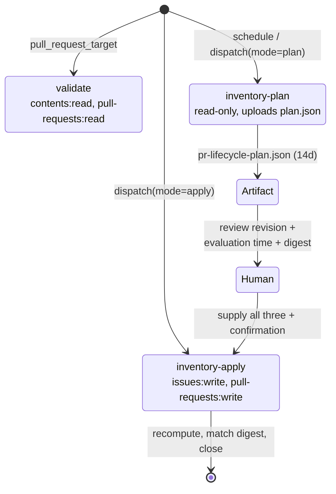

# feat: Bind PR lifecycle mutation to an exact reviewed plan

**Branch:** `agent/pr-lifecycle-reviewed-plan` (canonical) — **stacked on PR #307**, which introduces `scripts/sdlc/pr_lifecycle.py`. Not independently mergeable against `main`.

---

## Summary

Make the reviewed-plan lifecycle design live in the workflow GitHub actually runs, and delete the encoded-payload scaffolding that was staging it. The implementation (CLI, checks, tests, docs) is already present on this branch, inherited from PR #319. The remaining work is to apply one workflow file and remove three support-only artifacts.

---

## Problem Frame

`.github/workflows/pr-lifecycle.yml` still carries the original two-phase design: a boolean `apply` input and an `inventory-dry-run` job. The reviewed-plan design — generate an immutable plan, then apply only that exact plan, bound by revision, evaluation time, and digest — exists only as `scripts/support/exported_pr_lifecycle_reviewed_plan.yml`, a staged copy that GitHub never executes.

`newsroom/tests/test_pr_lifecycle.py::test_workflow_requires_separate_reviewed_plan_dispatch` reads the real workflow path and fails. The test is correct: a staged copy does not make the job live.

Separately, the branch carries a payload pipeline — 12 base64 chunks, a gzipped 1181-line self-applying patch generator, and two workflows that execute it — whose only purpose was to materialize that workflow on PR #319's branch.

---

## Requirements

- **R1.** `.github/workflows/pr-lifecycle.yml` implements the reviewed-plan design: `mode: choice(plan|apply)`, the three `reviewed_*` binding inputs, an `inventory-plan` job, and an `inventory-apply` job gated on all four dispatch conditions.
- **R2.** `test_workflow_requires_separate_reviewed_plan_dispatch` passes, and the full suite stays green (baseline on #319: 2101 passed, 38 skipped, 1 failed).
- **R3.** No base64 payload, self-applying patch script, or support-only workflow remains in the tree.
- **R4.** No workflow in the tree grants `contents: write`.
- **R5.** The PR body carries the mandatory six-field lifecycle metadata block, declaring `Lifecycle: canonical` and the #307 dependency.

---

## Key Technical Decisions

**KTD1 — Branch from PR #319's head rather than `main`.** *(session-settled: user-approved — chosen over re-porting ~800 lines from `main`: `scripts/sdlc/pr_lifecycle.py` does not exist on `main`; #307 introduces it, and #319's head already carries #307's content plus the complete reviewed-plan implementation.)*

**KTD2 — This PR is stacked on #307 and declares that dependency.** *(session-settled: user-approved — chosen over presenting it as independently mergeable: its base content comes from #307, so merging first would be incoherent.)*

**KTD3 — Apply the exported YAML into the real workflow and delete `scripts/support/` entirely.** *(session-settled: user-directed — chosen over retaining the chunk + self-applying-script pipeline: base64 blobs cannot be diff-reviewed, and this workflow runs on `pull_request_target` with the repo token, so reviewability of that file is load-bearing.)* The payload was verified to decode cleanly — all three manifest hashes match — to a 1181-line patch generator whose output is already tracked. It is build scaffolding, not source of truth.

**KTD4 — Delete the two `support-*.yml` workflows along with the payload.** Research finding, not carried in the brief: both trigger only on `push` to `support/pr-lifecycle-stale-checkpoint-plan-20260806`, so they can never fire on this branch, and they are the only references to `scripts/support/`. Keeping them would ship dead workflows pointing at deleted paths — one of them holding `permissions: contents: write`.

**KTD5 — Adopt `ref: ${{ github.sha }}` on all three checkouts.** For `pull_request_target`, `github.sha` is the last commit of the PR *base* branch, so this checks out trusted repository code, matching the "runs trusted default-branch code" guarantee in `docs/operations/pr-lifecycle.md`. It is stricter than the current `ref: github.event.repository.default_branch`, which resolves a moving tip at checkout time. All three checkouts also set `persist-credentials: false`.

---

## High-Level Technical Design

The workflow moves from a two-phase dry-run/apply shape to a three-phase design where mutation is bound to one exact, previously-reviewed plan.



There is deliberately no `needs:` edge between `inventory-plan` and `inventory-apply` — the binding travels through human-supplied dispatch inputs, not job dependency. The test asserts `"needs: inventory-plan" not in workflow`.

The apply gate is a four-way conjunction, all four required:

| Gate | Value |
|---|---|
| `inputs.mode` | `apply` |
| `inputs.reviewed_revision` | non-empty, must equal `github.sha` |
| `inputs.reviewed_evaluation_time` | non-empty |
| `inputs.reviewed_plan_digest` | non-empty, recomputed and compared |
| `inputs.confirmation` | `CLOSE_ELIGIBLE_DISPOSABLE_PRS` |

---

## Implementation Units

### U1. Make the reviewed-plan workflow live

**Goal:** `.github/workflows/pr-lifecycle.yml` becomes the reviewed-plan design.

**Requirements:** R1, R4. Implements KTD3 and KTD5.

**Dependencies:** none.

**Files:**
- `.github/workflows/pr-lifecycle.yml` (modify — 95 lines becomes 141)
- source content: `scripts/support/exported_pr_lifecycle_reviewed_plan.yml` (read before U2 deletes it)

**Approach:** The export is a complete, valid 141-line workflow already consistent with the branch's `docs/operations/pr-lifecycle.md`. Take its content wholesale rather than hand-porting hunks — hand-porting risks missing one of the exact string forms the test asserts. Confirm nothing in the live 95-line file is absent from the export before replacing.

Behavioral deltas: `apply: boolean` becomes `mode: choice(plan|apply)` plus three `reviewed_*` string inputs; `inventory-dry-run` becomes `inventory-plan` with an `upload-artifact` step; all three checkout refs become `github.sha`.

**Patterns to follow:** job-level `permissions` blocks scoped per job, as the existing file already does. Keep `persist-credentials: false` on every checkout.

**Test scenarios:** covered by the existing `test_workflow_requires_separate_reviewed_plan_dispatch`, which is a full specification of the target file. It asserts job names, all four apply-gate conditions, `count("ref: ${{ github.sha }}") == 3`, `count("GITHUB_TOKEN: ${{ github.token }}") == 2`, `"contents: write" not in workflow`, absence of a `needs:` edge, and `contents: read` inside the `inventory-apply` permissions block. Do not add new tests for this unit; do not weaken any assertion to make it pass.

**Verification:** that test passes, and the workflow parses as valid YAML.

### U2. Delete the support-only payload machinery

**Goal:** no encoded payload, patch generator, or support-only workflow remains.

**Requirements:** R3, R4. Implements KTD3 and KTD4.

**Dependencies:** U1 (U1 reads the export before it is deleted).

**Files (all deleted):**
- `scripts/support/pr_lifecycle_reviewed_plan_chunks/` (12 `.b64` files)
- `scripts/support/pr_lifecycle_reviewed_plan_chunks.manifest.json`
- `scripts/support/apply_pr_lifecycle_reviewed_plan_fix.py.gz.b64`
- `scripts/support/apply_pr_lifecycle_stale_checkpoint_fix.py`
- `scripts/support/exported_pr_lifecycle_reviewed_plan.yml`
- `.github/workflows/support-pr-lifecycle-reviewed-plan.yml`
- `.github/workflows/support-pr-lifecycle-stale-checkpoint.yml`

**Approach:** Delete the whole `scripts/support/` directory and both support workflows together. They form one closed set: the two workflows are the only referrers to the payload, and the payload is the only thing the workflows run. Removing one without the other leaves a broken reference.

**Test scenarios:** `Test expectation: none -- pure deletion of untested scaffolding.` The guard is the suite-wide check in U3 plus a grep confirming no remaining reference to `scripts/support`.

**Verification:** `scripts/support/` is gone, both support workflows are gone, and a repo-wide grep for `scripts/support` returns no hits outside `.git/`.

### U3. Verify the suite and declare the stacked dependency

**Goal:** the branch is green and the PR states its relationship to #307.

**Requirements:** R2, R5. Implements KTD2.

**Dependencies:** U1, U2.

**Files:** none modified — this unit is verification plus PR metadata.

**Approach:** Run the full suite. Expect the #319 baseline with the one failure resolved: 2102 passed, 38 skipped, 0 failed (count may shift if other tests reference the deleted workflows — investigate rather than adjust the expectation).

The PR body must carry the six mandatory fields from `docs/operations/pr-lifecycle.md`:

```text
Lifecycle: canonical
Delivery-Atom: pr-lifecycle-reviewed-plan
Canonical-PR: self
Checkpoint-Ref: NONE
Close-When: merged
Branch-Retention: keep
```

and state in prose that it is stacked on #307 and must not merge before it.

**Test scenarios:** `Test expectation: none -- this unit runs existing tests and writes PR prose.`

**Verification:** full suite green; PR body contains all six fields and the #307 dependency statement.

---

## Scope Boundaries

**In scope:** the workflow file, the payload deletion, the suite, the PR metadata.

**Not in scope:** any change to `scripts/sdlc/pr_lifecycle.py`, `newsroom/checks/pr_lifecycle.py`, `newsroom/tests/test_pr_lifecycle.py`, or `docs/operations/pr-lifecycle.md`. All four arrive complete from #319. If a test fails, fix the workflow — never the assertion.

### Deferred to Follow-Up Work

- Closing PR #319 as checkpointed once this lands (a lifecycle action on that PR, not a code change here).
- Merging PR #307, which must land first.
- Any retention policy for `checkpoint/*` and `support/*` branch growth.

---

## Risks & Dependencies

| Risk | Mitigation |
|---|---|
| #307 merges after this, or never — this PR's base content is orphaned | Declare the stack in the PR body (U3); do not mark ready-for-merge before #307 |
| A test elsewhere asserts on the deleted support workflows | U3 runs the full suite, not just the one test |
| Accidental push to PR #319's branch | Branch upstream was deliberately unset; push must set a new upstream explicitly |
| Replacing the workflow wholesale drops something the live file had | U1 requires confirming the live 95 lines are a subset before replacing |

**Hard dependency:** PR #307 (`agent/pr-lifecycle-housekeeping`) introduces `scripts/sdlc/pr_lifecycle.py`.

---

## Sources & Research

- `docs/operations/pr-lifecycle.md` (on this branch) — lifecycle classes, metadata contract, permission constraints, the never-delete-a-ref rule.
- `newsroom/tests/test_pr_lifecycle.py:1239` — the target-state specification for U1.
- Payload verification: 12 chunks reassemble to 12268 b64 chars, gzip sha256 `5e9821e6…`, decoding to 37407 bytes, source sha256 `ab27f3cd…` — all three matching the committed manifest.
- GitHub Actions `pull_request_target` semantics: `github.sha` resolves to the base branch's last commit, which grounds KTD5.

---

## Definition of Done

1. `.github/workflows/pr-lifecycle.yml` implements the reviewed-plan design (R1).
2. `test_workflow_requires_separate_reviewed_plan_dispatch` passes; full suite green (R2).
3. `scripts/support/` and both `support-*.yml` workflows are gone; no references remain (R3).
4. No workflow grants `contents: write` (R4).
5. PR body carries the six lifecycle fields and declares the #307 stack (R5).
