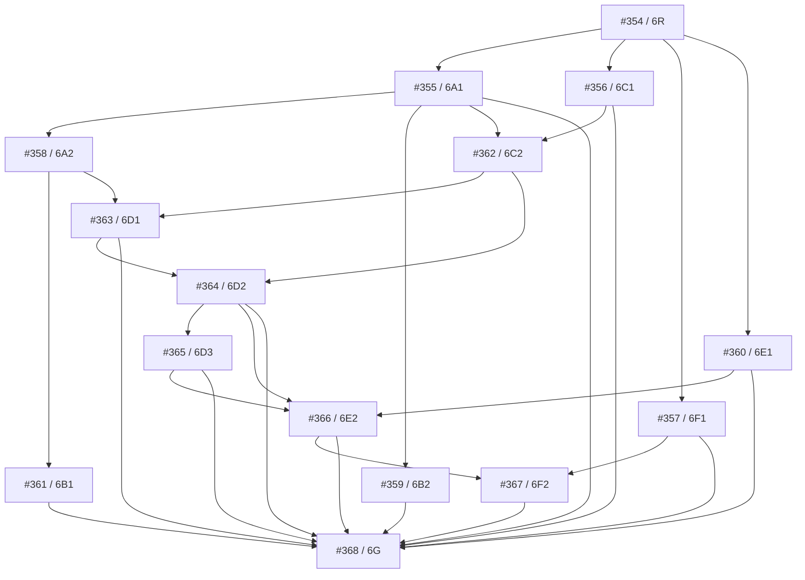

# Increment 6 current-head readiness and allocation

**Issue:** #354 / 6R
**Parent:** #146 / Increment 6
**Gate:** Tier S
**Accepted implementation base:** `main@ba0832b4d0ac7b9a65f318beb266889c9dcd9f2e`
**Accepted tree:** `069f19698f8bfe6d0f8453219ccd961c89be94c4`
**Checked authority schema:** v16 / `graphiti_proposal_adapter_v16`
**Checked schema fingerprint:** `sha256:b5a6d2afc78838cdeb648e7cd34b66452f2e0a0f7dab4773dd17a4cc28e3b5d8`

## 1. Decision and effect

This package admits Increment 6 implementation only within the allocations below. It binds the final Increment 5 interfaces, reserves disjoint public modules, serialisation identities, table names and migration versions, and fixes the dependency waves and gate policy before parallel branches merge.

The machine-readable authority for this allocation is:

- `newsroom/increment6/increment6_readiness_v1.json`;
- exact contract digest `sha256:13b43c927e4222c143b8691eaf179eb956096c19a72f4cc29cae13008d6e0590`;
- `newsroom.increment6.readiness` validates its exact canonical bytes, content digest, source-bound inherited interfaces, ownership uniqueness, migration sequence and dependency waves;
- `newsroom/tests/test_increment6r_readiness.py` proves the checked v1-v16 history prefix while permitting compatible additive v17-v25 successors.

The record becomes effective only when present on `main` after the reviewed 6R merge. Its digest is content identity, not runtime authority. The package applies no migration and creates no external effect.

## 2. Exact inherited interface inventory

| Interface | Exact current module and seam | Increment 6 binding |
|---|---|---|
| Truthful Retrieval Context | `newsroom.increment5.retrieval_context`: `RetrievalContextRequest`, `RetrievalContextReceipt`, `RetrievalContextOutcome`, `RetrievalContextReason`, `RetrievalAuthorityEvidence`, `RetrievalContextBuilder`, `context_collision_key_digest` | The immutable, authority-hydrated context is the only admitted triage retrieval input. `INCOMPLETE`, `POLICY_BLOCKED`, `STALE`, `UNAVAILABLE` and other non-complete outcomes remain evidence and never become usable passages. |
| Current collision receipt | `NamedAuthorityExecutionReceipt`, `NamedAuthorityExecutionOutcome`, `NamedAuthorityExecutionReason`, plus `validate_named_authority_receipt` | #360 consumes and revalidates the exact receipt before any Candidate-use decision. Callers cannot widen, replace, cache past freshness or reinterpret it. |
| Retained fixture identities | `newsroom.integrated`: Lead, Signal, Proposal, Hypothesis and Candidate identity types and fixture Candidate admission views | These are compatibility inputs only. They do not allocate new Increment 6 Work Item, Proposal, Hypothesis, Candidate or Handoff authority. |
| Lead disposition and Watch authority | `newsroom.discovery`: exact `NewsLead`, `LeadDispositionDecision`, `LeadDispositionOutcome`, `WatchCondition` identities, requests and IDs | Existing immutable Lead decisions and Watch Conditions are admitted upstream authority. #355 maps their outcome, next-action and terminality vocabulary; #358 binds them into Work Items and owns supplemental-discovery re-entry; #368 must prove that re-entry path. |
| Checked SQLite authority schema | `newsroom.authority.migrations`: accepted v1-v16 history and v16 fingerprint | 6R itself advances nothing. Permanent validation requires the exact accepted v1-v16 prefix and admits only additive live successors, so allocated v17-v25 migrations do not invalidate 6R. |

The exact inherited contract digests and per-symbol source digests are retained in the canonical 6R record and checked against the importable current-head symbols. The evolving migration registry has a stable callable-shape check plus the exact accepted-history-prefix rule instead of a permanent v16 freeze. Any incompatible drift fails the readiness inventory check.

## 3. Sole public-interface owners

| Atom | Sole public module | Sole interface ownership |
|---|---|---|
| #354 / 6R | `newsroom.increment6.readiness` | Readiness/allocation contract and Increment 6 package root |
| #355 / 6A1 | `newsroom.increment6.outcomes` | Triage Outcome, Reason Code, Priority Lane, canonical Next Action, terminality, Watch mapping and supplemental-action mapping |
| #356 / 6C1 | `newsroom.increment6.proposals` | Triage Proposal, content identity and Proposal-no-authority boundary |
| #357 / 6F1 | `newsroom.increment6.handoffs` | Evaluation Handoff, Handoff Attempt, acknowledgement and transport state |
| #358 / 6A2 | `newsroom.increment6.work_items` | Triage Work Item, immutable Work Item Version, current/stale rules, exact Lead-disposition/Watch binding and supplemental-discovery re-entry |
| #359 / 6B2 | `newsroom.increment6.scheduling` | Urgency/deadline, reserved-capacity and starvation-observation policy |
| #360 / 6E1 | `newsroom.increment6.collision` | Current-collision eligibility decision and pre-effect enforcement |
| #361 / 6B1 | `newsroom.increment6.execution` | Execution Batch, Worker Attempt and Work Item lease ownership |
| #362 / 6C2 | `newsroom.increment6.dispositions` | Proposal validation finding, immutable disposition, disposition authority and validated-Proposal-to-Lead-disposition binding |
| #363 / 6D1 | `newsroom.increment6.hypotheses` | Event Hypothesis, immutable Hypothesis Version and current-version rule |
| #364 / 6D2 | `newsroom.increment6.relationships` | Hypothesis relationship decision and reason |
| #365 / 6D3 | `newsroom.increment6.lineage` | Consolidation, split and correction/reversal lineage |
| #366 / 6E2 | `newsroom.increment6.candidates` | Story Candidate, immutable Candidate Version, admission and current-version rule |
| #367 / 6F2 | `newsroom.increment6.feedback` | Evaluation Feedback, reconciliation obligation and immutable disposition |
| #368 / 6G | `newsroom.increment6.closeout` | Increment 6 closed-world receipt, final proof and supplemental-discovery re-entry proof |

A branch may consume another owner's public interface after that dependency is fixed. It must not create a private alias, re-export the type from another public module, or edit the owning module. `newsroom.increment6.__init__` remains owned by 6R; child contracts are imported from their allocated public modules.

## 4. Checked migration and schema allocation

The v17-v25 sequence is contiguous and singly owned. Pure-contract and enforcement-only atoms receive no migration.

| Version | Atom | Migration module and name | Reserved tables |
|---:|---|---|---|
| 17 | #357 / 6F1 | `newsroom.authority.evaluation_handoff_migrations` / `evaluation_handoff_authority_v17` | `evaluation_handoffs`, `evaluation_handoff_attempts`, `evaluation_handoff_acknowledgements` |
| 18 | #358 / 6A2 | `newsroom.authority.triage_work_item_migrations` / `triage_work_item_authority_v18` | `triage_work_items`, `triage_work_item_versions`, `triage_work_item_heads` |
| 19 | #362 / 6C2 | `newsroom.authority.triage_disposition_migrations` / `triage_proposal_disposition_authority_v19` | `triage_proposal_validation_findings`, `triage_proposal_dispositions` |
| 20 | #361 / 6B1 | `newsroom.authority.triage_execution_migrations` / `triage_execution_authority_v20` | `triage_execution_batches`, `triage_worker_attempts`, `triage_work_item_leases` |
| 21 | #363 / 6D1 | `newsroom.authority.event_hypothesis_migrations` / `event_hypothesis_authority_v21` | `event_hypotheses_v2`, `event_hypothesis_versions_v2`, `event_hypothesis_heads_v2` |
| 22 | #364 / 6D2 | `newsroom.authority.event_hypothesis_relationship_migrations` / `event_hypothesis_relationship_authority_v22` | `event_hypothesis_relationship_decisions` |
| 23 | #365 / 6D3 | `newsroom.authority.event_hypothesis_lineage_migrations` / `event_hypothesis_lineage_authority_v23` | `event_hypothesis_lineage`, `event_hypothesis_lineage_heads` |
| 24 | #366 / 6E2 | `newsroom.authority.story_candidate_migrations` / `story_candidate_authority_v24` | `story_candidate_heads`, `story_candidate_admission_receipts_v2`, `story_candidate_collision_bindings` |
| 25 | #367 / 6F2 | `newsroom.authority.evaluation_feedback_migrations` / `evaluation_feedback_authority_v25` | `evaluation_feedback`, `evaluation_reconciliation_obligations`, `evaluation_reconciliation_dispositions` |

#355, #356, #359 and #360 must remain migration-free. #359 stays Tier L only while it remains pure policy. #354 and #368 add no authority schema.

Every migration owner must use its reserved version, module, name and table identities. The version order follows the admitted waves: v17 in Wave 1; v18-v19 in Wave 2; v20-v21 in Wave 3; then v22-v25 sequentially. The shared `newsroom.authority.migrations` registry is a serial integration surface: after rebasing to current `main`, each migration is added in reserved numeric order. Parallel branches never independently renumber or claim the same central-registry edit.

Each migration gate must prove:

1. fresh creation through the complete retained history;
2. upgrade from the exact predecessor version;
3. one exclusive transaction and rollback on injected failure;
4. exact migration history and schema fingerprint;
5. `PRAGMA foreign_key_check` empty; and
6. `PRAGMA quick_check = 'ok'`.

## 5. Dependency graph and safe parallel waves

The admitted implementation schedule is:

- **Wave 0:** #354 only;
- **Wave 1:** #355, #356, #357 and #360;
- **Wave 2:** #358, #359 and #362;
- **Wave 3:** #361 and #363;
- **Wave 4:** #364;
- **Wave 5:** #365;
- **Wave 6:** #366;
- **Wave 7:** #367;
- **Wave 8:** #368, and it must remain last.

#368 must additionally prove both the normal Signal-to-Candidate path and the supplemental-discovery re-entry path from an immutable Lead disposition or Watch Condition through a new governed Work Item. Completing only the normal path does not satisfy the Increment 6 stop boundary.

Bounded preparation for #355, #356 and #357 may exist as draft PRs before 6R merges. They must rebase to the accepted 6R head, retain only their allocated files, and pass their complete gate before becoming ready for review or merge.

## 6. Compatibility and rollback boundary

- Migrations are additive. Retained authority rows and historical identities are never rewritten or retargeted.
- 6R itself is rolled back by reverting its code and contract before any v17 migration; it has no data effect.
- Before each v17-v25 upgrade, retain an exact pre-migration backup and its digest.
- A destructive down-migration is prohibited. Data rollback means restore the exact pre-migration backup after stopping writers and proving its identity.
- Older application code must fail closed on a newer `PRAGMA user_version`; it must not partially serve or silently ignore new tables.
- Code-only disablement may stop new commands, but it does not delete retained attempts, decisions, lineages, acknowledgements or reconciliation obligations.
- A migration failure must leave the predecessor version, history and fingerprint unchanged.

## 7. Tier gates

### Tier L

Focused tests, one complete deterministic CI run, source-integrity and boundary checks, one feature-complete review, and zero P1/material-P2 findings.

### Tier S

All Tier L requirements plus only the affected Authority, Projection and actual-service lanes; checked migration/upgrade/rollback proof when persistence is present; and restart, replay and concurrency proof where applicable.

### Tier M

All applicable permanent workflows on one exact `main` SHA; signed SDLC decision; integrated actual-service and closed-world evidence; independent verification; and zero P1/material-P2 findings.

P1 always blocks. P2 blocks when it concerns correctness, authority, rights, security, data loss, false success or evidence integrity. A normal multi-commit branch may be squash-merged. Use one canonical PR per atom and do not create patch-carrier PRs.

## 8. Fixed exclusions

Increment 6 introduces none of the following:

- live model or provider execution, credentials, egress or spend;
- evidence acquisition or Evidence Intake authority;
- drafting, publication, publication credentials or public effect;
- shadow, canary or production activation;
- Increment 7 Agenda/search/local-watch runtime; or
- Increment 8 evaluation/operations runtime.

The Handoff target is an evaluation-only sink. Discovery remains non-evidence. A Proposal grants no Hypothesis or Candidate authority. Evaluation feedback grants no publication authority.

## 9. Child reconciliation and completion checklist

Before #354 closes:

- every #355-#368 issue must reference this exact 6R contract digest and accepted 6R merge SHA;
- every child dependency, gate tier, module, schema identity and migration allocation must agree with the canonical record;
- bounded-preparation PRs must be checked for ownership drift and must remain unmerged until 6R is on `main`;
- focused readiness tests and the affected checked-migration lane must pass;
- substantive review must report zero P1/material-P2 findings; and
- the PR must merge on the exact accepted Increment 5 base without introducing a migration or public effect.
