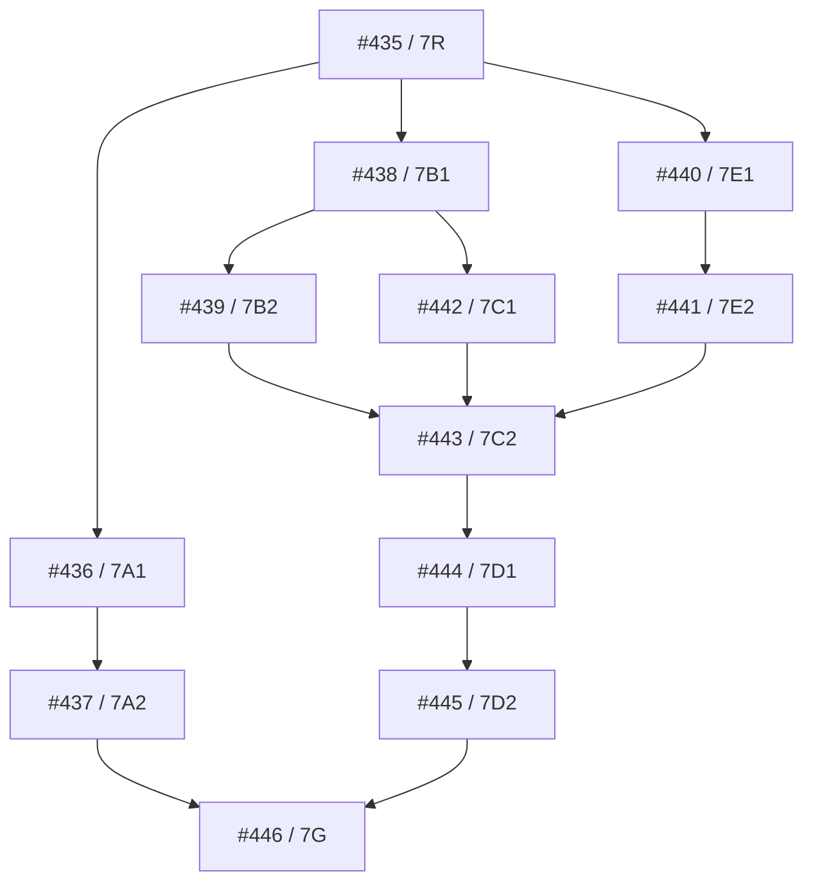

# Increment 7 current-head readiness and allocation

**Issue:** #435 / 7R
**Parent:** #147 / Increment 7
**Gate:** Tier S
**Accepted implementation base:** `main@ddd77f7e96ebe8df42861631dc47005c30048662`
**Accepted tree:** `f5109a81962db2d4206426abfc152c890ef5d461`
**Checked authority schema:** v25 / `evaluation_feedback_authority_v25`
**Checked schema fingerprint:** `sha256:353900bf5804f0b770489982541f3cff4fd30ea36fc75d19b9c63315d1b6ec06`

## Decision and non-effect boundary

The exact Increment 6 dependency gate is satisfied. This 7R record admits only the atomic allocations below. It applies no migration and grants no provider, query, locality, credential, egress, spend, model, evidence, publication, shadow, canary or production authority. Increment 7 remains fixture/replay only.

Machine authority is `newsroom/increment7/increment7_readiness_v1.json`, validated by `newsroom.increment7.readiness`. It becomes effective only when the reviewed 7R PR is present on `main`.

## Sole owners and migrations

| Issue | Atom | Public module | Tier | Migration / reserved tables |
|---|---|---|---|---|
| #435 | 7R | `newsroom.increment7.readiness` | S | none |
| #436 | 7A1 | `newsroom.increment7.agenda` | L | none |
| #437 | 7A2 | `newsroom.increment7.agenda_authority` | S | v26 `planned_agenda_authority_v26`; `planned_agenda_items`, `planned_agenda_versions`, `planned_agenda_heads`, `planned_agenda_resolutions` |
| #438 | 7B1 | `newsroom.increment7.search` | L | none |
| #439 | 7B2 | `newsroom.increment7.search_authority` | S | v27 `bounded_search_authority_v27`; purpose/request/attempt/outcome/result/review/budget tables |
| #440 | 7E1 | `newsroom.increment7.provider_qualification` | L | none |
| #441 | 7E2 | `newsroom.increment7.locality_qualification` | L | none |
| #442 | 7C1 | `newsroom.increment7.coverage` | L | none |
| #443 | 7C2 | `newsroom.increment7.coverage_authority` | S | v28 `coverage_audit_authority_v28`; audit/observation/gap/decision tables |
| #444 | 7D1 | `newsroom.increment7.local_watch` | L | none |
| #445 | 7D2 | `newsroom.increment7.local_watch_authority` | S | v29 `event_scoped_local_watch_authority_v29`; watch/version/head/closure tables |
| #446 | 7G | `newsroom.increment7.closeout` | M | none |

The central migration registry is a serial integration surface. Owners rebase to current `main` and merge only in reserved v26–v29 order. All migrations are additive, require exact predecessor backup and restore proof, and must fail closed against newer schema.

## Dependency waves

- Wave 0: #435.
- Wave 1: #436, #438, #440.
- Wave 2: #437, #439, #441, #442.
- Wave 3: #443.
- Wave 4: #444.
- Wave 5: #445.
- Wave 6: #446, last.

7C contract preparation may proceed beside 7B2, but 7C persistence consumes the final accepted Search and locality identities. Every Agenda/Search/Gap/Watch supplemental path must re-enter through new governed Discovery lineage and the retained Increment 6 Work Item boundary; no clock or record alone creates a Lead or Candidate.

## Gates

Tier L requires focused deterministic tests, source-integrity and boundary checks, one feature-complete review and zero P1/material-P2 findings. Tier S adds checked migration/upgrade/rollback and applicable restart, replay, concurrency, authority and actual-service lanes. Tier M requires all applicable permanent workflows on one exact `main` SHA, signed SDLC decision, integrated actual-service evidence, independent verification and the complete Agenda → Search → Audit → Gap → Watch → closure → Increment 6 re-entry proof.
