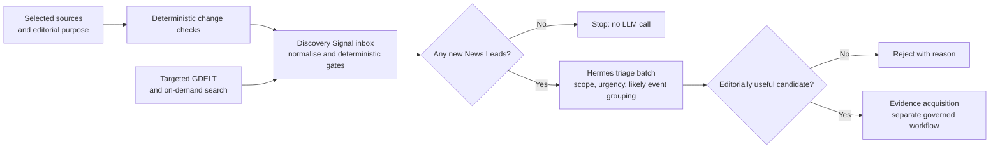

# Low-cost news discovery for a beat-first newsroom

**Status:** Research recommendation  
**Owner:** Product owner  
**Canonical language:** UK English  
**As of:** 2026-07-15  
**Scope:** Discovery only; evidence acquisition, long-term storage and RAG are deliberately out of scope

## Executive decision

Brave Search is not the only way to build the radar, and it should not be the core of the launch architecture.

For this newsroom's deliberately narrow audience and editorial scope, the best launch design is **source-registry first**:

1. monitor a curated allow-list of recurring UK and Hong Kong official sources through RSS/Atom, APIs, email alerts and calendars;
2. use deterministic Hermes cron jobs to poll those sources without an LLM and wake an agent only when something changed;
3. use conditional page-change monitoring only where no machine-readable interface exists;
4. use a small set of established-media feeds as lead generators, not as publication evidence;
5. use targeted GDELT queries as an outer radar for unknown unknowns;
6. keep a provider-neutral, tightly capped search lane available at launch for explicit gaps and recall measurement; Brave may implement that lane only under an approved budget and is never the production clock.

This follows the product's actual scope: useful developments for Hong Kong people and families in the UK, rather than a general-purpose world-news firehose. The governing editorial boundary is already defined in the [product and editorial charter](../reference/editorial/product-editorial-charter.en.md).

Hermes is well suited to running this design, but **installing a skill does not itself create a news source**. A skill supplies instructions and scripts. The source registry, polling rules and editorial triage policy still belong to the newsroom. Hermes' official watcher skill can monitor RSS/Atom, HTTP JSON and GitHub sources with watermarks, while Hermes cron supports script-only `no_agent` jobs and pre-checks that skip the LLM when there is no work ([official watcher skill](https://github.com/NousResearch/hermes-agent/blob/main/optional-skills/devops/watchers/SKILL.md), [Hermes cron](https://hermes-agent.nousresearch.com/docs/user-guide/features/cron), [script-only cron guide](https://hermes-agent.nousresearch.com/docs/guides/cron-script-only), [Hermes skills](https://github.com/NousResearch/hermes-agent/blob/main/website/docs/user-guide/features/skills.md)).

## The layered radar

"Beat first" should mean that every monitored endpoint belongs to an editorial beat and has an explicit reason for being watched. It should not mean repeatedly sending broad beat keywords to a search API.

| Layer | Signal | Typical cadence | Purpose |
|---|---|---:|---|
| 0. Scheduled | Release calendars, parliamentary business, consultations and known deadlines | Daily, plus event reminders | Know what is likely to become news before it happens |
| 1. Urgent official | Weather warnings, floods, safety alerts and material service disruption | 5–15 minutes | Fast, authoritative public-safety awareness |
| 2. Routine official | Government, legislature, regulator, health, education and statistics feeds | 30–60 minutes | High-precision policy and public-service discovery |
| 3. Curated media | A small allow-list of established UK, Hong Kong and community sources | 15–30 minutes | Breaking leads, lived impact and stories outside official publication patterns |
| 4. Outer radar | Targeted GDELT, then on-demand SearXNG/DDGS/Brave | 30–60 minutes or a few batches daily | Detect gaps and events outside the fixed allow-list |

The launch registry should start with the smallest source subset that covers the agreed beats and should grow only when a missed-story audit identifies a real gap.

No locality coverage promise or detection service objective has been accepted. Local sources are later candidates only when the agreed beats or shadow evidence justify them.

## Sources that match the initial scope

The following are examples of recurring, first-party interfaces that can cover much of the initial scope without paid web search.

| Beat | UK monitoring candidates | Hong Kong monitoring candidates |
|---|---|---|
| Government, immigration, tax, benefits, health and education | GOV.UK topic, organisation, search-result and page email subscriptions; the GOV.UK Content API provides structured page content and metadata ([email updates](https://www.gov.uk/help/get-emails-about-updates-to-govuk), [notification model](https://docs.publishing.service.gov.uk/manual/email-notifications-how-they-work.html), [Content API](https://content-api.publishing.service.gov.uk/), [public-sector API catalogue](https://www.api.gov.uk/)) | The GovHK directory exposes HKSAR press releases, news.gov.hk categories, Education Bureau updates, Centre for Health Protection publications and other official feeds ([GovHK RSS directory](https://www.gov.hk/en/about/rss.htm), [HKSAR press-release dataset and feeds](https://data.gov.hk/en-data/dataset/hk-isd-gnmis-gnmis)) |
| Parliament, legislation and planned public business | UK Parliament publishes bill and research RSS feeds; its What's On service supports JSON, XML, RSS, Atom and iCalendar ([Parliament RSS](https://www.parliament.uk/site-information/rss-feeds/), [What's On API](https://whatson-api.parliament.uk/), [calendar subscriptions](https://api.parliament.uk/egg-timer/meta/subscribe)) | LegCo publishes feeds for Council meetings, bills, committees, Finance Committee and policy panels including education, housing, manpower, security, transport and welfare ([LegCo RSS directory](https://www.legco.gov.hk/en/rss/rss.html)) |
| Statistics and scheduled releases | The ONS release API covers published, cancelled and upcoming releases with date filters; the release calendar also offers RSS, email and calendar routes ([ONS release API](https://developer.ons.gov.uk/search/search-releases/), [release calendar](https://www.ons.gov.uk/releasecalendar)) | The Census and Statistics Department publishes statistics feeds through GovHK and an advance release schedule ([GovHK RSS directory](https://www.gov.hk/en/about/rss.htm), [C&SD release practice](https://www.censtatd.gov.hk/en/page_898.html)) |
| Weather and public safety | Met Office regional warning emails and the Environment Agency's near-real-time flood API; the flood API requires no registration and supports `Last-Modified`/`If-Modified-Since` ([Met Office alerts](https://www.metoffice.gov.uk/about-us/news-and-media/media-centre/subscribe-to-email-alerts), [flood-monitoring API](https://environment.data.gov.uk/flood-monitoring/doc/reference)) | Hong Kong Observatory warning and forecast feeds are listed in the GovHK directory ([GovHK RSS directory](https://www.gov.hk/en/about/rss.htm)) |
| Finance, consumer and regulators | Relevant GOV.UK organisation/search subscriptions and regulator feeds should be registered individually, with their own terms and priority | HKMA offers a press-release API and the SFC publishes RSS feeds ([HKMA API](https://apidocs.hkma.gov.hk/documentation/press-releases/), [SFC RSS](https://www.sfc.hk/en/RSS-Feeds)) |
| Transport | National Rail offers developer feeds for service disruption and engineering information; registration and the licence for each feed must be checked ([National Rail developer feeds](https://www.nationalrail.co.uk/developers/), [journey-planner feeds](https://www.nationalrail.co.uk/developers/online-journey-planner-data-feeds/)) | Register only the specific official transport feeds or alert pages that prove useful to the target audience |
| Established media | Select topic or local feeds only after an editorial source review | GovHK's official directory includes RTHK local, Greater China, world and finance feeds, which are useful as lead signals ([GovHK RSS directory](https://www.gov.hk/en/about/rss.htm)) |

This is not a final allow-list. The exact launch subset remains a product decision. The important architectural change is to register stable source interfaces rather than monitor whole homepages or issue broad searches continuously.

## Option comparison

| Option | Marginal monetary cost | Coverage and precision | Operational or rights cost | Recommended role |
|---|---:|---|---|---|
| Direct RSS/Atom and official APIs | Usually no per-request fee for the examples above | High precision and fast for known institutions; weak for events outside the registry | Endpoint maintenance; each source still needs a licence/terms record | Core |
| Email alerts | Usually no per-message fee | Strong for departments, topics, warnings and page-specific changes | Delivery delay, duplicate mail and deterministic MIME/link parsing | Core where no better feed exists |
| RSS/Atom/iCalendar release calendars | Usually no per-request fee | Excellent for anticipated releases; not a breaking-news channel | Must distinguish a scheduled event from an actual development | Core Layer 0 |
| Conditional HTTP/page diff | Local compute and bandwidth | Covers stable pages and PDFs without a feed; precision depends on selectors | Layout churn, false positives, rate limits and site terms | Gap filler only |
| Curated media feeds | Usually no per-request fee | Broader and faster than official sources; more duplicates and lower authority | Copyright and excerpt-retention constraints | Lead discovery only |
| GDELT DOC 2.0 | No dataset/API fee under GDELT's published terms | Broad multilingual media radar with RSS/JSON and up to 250 article-list results; automated and noisy | Attribution is required; coverage and event interpretation must not be treated as fact | Targeted outer radar ([DOC 2.0](https://blog.gdeltproject.org/gdelt-doc-2-0-api-debuts/), [GDELT terms](https://www.gdeltproject.org/about.html)) |
| DDGS through Hermes | No API key or contracted query fee | Useful ad hoc search | The official Hermes skill warns about rate limiting, cloud-IP blocking and snippet-only results | Manual or bounded fallback ([Hermes DDGS skill](https://github.com/NousResearch/hermes-agent/blob/main/optional-skills/research/duckduckgo-search/SKILL.md)) |
| Self-hosted SearXNG through Hermes | No metasearch licence or per-query fee; local hosting cost | Aggregates configurable engines without user profiling | Upstream engines can CAPTCHA or block it, so coverage is not guaranteed | Optional search fallback, not a clocked monitor ([SearXNG about](https://docs.searxng.org/user/about.html), [engine model](https://docs.searxng.org/dev/engines/engine_overview.html), [limiter](https://docs.searxng.org/admin/searx.limiter)) |
| Brave News/Search API | Current list price is US$5 per 1,000 requests with US$5 monthly credits | Independent broad index and straightforward API | Cost grows linearly; storage, caching and redistribution of results are contractually constrained | Never the production clock; optional hard-capped launch adapter for recall audit or explicit gaps ([pricing](https://brave.com/search/api/), [News API](https://api-dashboard.search.brave.com/api-reference/news/news_search/get), [terms](https://api-dashboard.search.brave.com/app/documentation/general/terms-of-service)) |

The current documented schedule—one hourly Brave fetch plus two Brave fetches in each of two daily runs—can reach roughly **840 requests in a 30-day month before retries or fallbacks**. That is already close to the present monthly credit. Search-first discovery also spends the same request budget when nothing has changed. Direct watchers do not have that economic shape.

## Self-hosted monitoring tools

The simplest stack is Hermes plus small repository-owned pollers. Extra infrastructure should be added only for a demonstrated gap.

- **Hermes official watchers:** the best first step for RSS/Atom and JSON. It maintains watermarks, baselines silently on the first run and emits only new items. Pair it with `no_agent` cron so unchanged polls use no model tokens ([watcher skill](https://github.com/NousResearch/hermes-agent/blob/main/optional-skills/devops/watchers/SKILL.md)).
- **changedetection.io:** a good secondary service for a limited number of pages or PDFs with no feed. It supports HTTP or browser fetches, CSS/XPath/JSONPath selectors, schedules, webhooks and an API. Its own documentation correctly places responsibility for terms, robots rules and applicable law on the operator ([official repository](https://github.com/dgtlmoon/changedetection.io)).
- **RSS-Bridge:** can turn some non-feed sites into feeds and cache results, but adapters are site-dependent and can break. Use it only after confirming the site's terms and only when a direct interface is unavailable ([official repository](https://github.com/RSS-Bridge/rss-bridge), [official FAQ](https://rss-bridge.github.io/rss-bridge/General/FAQ.html)).
- **Huginn:** can join RSS, web, email, JavaScript and webhook agents into workflows, but it introduces a Rails application and database to operate. That is unnecessary at launch while Hermes already provides scheduling and agent wake-up ([official repository](https://github.com/huginn/huginn)).

Email and iCalendar are not covered by the present official Hermes watcher. They should be handled by small deterministic, repository-owned adapters: poll a dedicated mailbox, extract canonical links and message identifiers; fetch calendars and deduplicate on `UID` plus revision. Those adapters can emit the same lead envelope as RSS/API watchers without invoking an LLM.

## Discovery is not evidence acquisition

The radar should answer only: **"Is there a potentially relevant development worth triaging?"** It should not fetch and retain every article, decide truth, or authorise publication.

At discovery time, retain only enough permitted metadata to recognise a new or revised item, suppress repeats and link triage back to the source. Exact fields, retention and storage are deliberately deferred to the later data-workflow discussion.

Only a lead accepted by triage should enter evidence acquisition. At that point the newsroom can locate the primary record, corroborate it, assess source quality and apply the separate rights rules for fetching, retaining, model use, quotation and display. A search snippet, media headline or GDELT record can point to a story; none is publication evidence merely because the radar found it.

## Rights-aware and polite monitoring

Before a source is activated, its permitted discovery use and polite-access constraints need to be checked. The exact registry representation is not decided here.

- Prefer ETags and `If-None-Match`, or `Last-Modified` and `If-Modified-Since`, so unchanged resources can return `304 Not Modified` ([HTTP conditional requests, RFC 9110](https://www.rfc-editor.org/rfc/rfc9110.html)).
- Honour rate limits, cache headers and `Retry-After`; add jitter rather than having all jobs hit sources on the minute.
- Honour `robots.txt`, but do not treat an allowed path as publication or reuse permission. The Robots Exclusion Protocol explicitly says its rules are not access authorisation ([RFC 9309](https://www.rfc-editor.org/rfc/rfc9309.html)).
- Record source-specific reuse terms. GOV.UK content is generally reusable under the Open Government Licence subject to the stated conditions, but that does not automatically cover every third-party asset on a page ([GOV.UK reuse terms](https://www.gov.uk/help/reuse-govuk-content)).
- Do not build a permanent cache of Brave result payloads or snippets. Brave's current terms restrict storage, caching and redistribution; retain only the newsroom's independently justified lead record and canonical source URL where permitted ([Brave terms](https://api-dashboard.search.brave.com/app/documentation/general/terms-of-service)).

## Candidate Hermes flow

This is an operating option for later validation, not implementation authorisation.

Hermes' documented watcher and conditional-wake behaviours show that this flow is feasible. The actual skill, adapters and schedule remain implementation choices.

## Suggested shadow check

- Compare the smallest selected direct-watch subset with a bounded media or search sample.
- Record relevant misses, duplicates, broken sources, model wake-ups and search requests.
- Add a source or paid search lane only when that evidence shows a material gap.

## Recommendation to carry into architecture design

Adopt the following discovery decision:

> **The launch newsroom uses a beat-owned source registry and deterministic change monitoring as its primary discovery engine. Hermes wakes an LLM only for batches of new signals. Page-diff tools fill explicit source gaps; targeted GDELT provides the outer radar; provider-neutral web search remains hard-capped for recall measurement and exceptional gaps but is never the production clock. Discovery produces leads only and never substitutes for governed evidence acquisition.**

The next architecture decision is the smallest source subset worth shadowing. Evidence storage and RAG follow only after the sourcing flow is settled.
